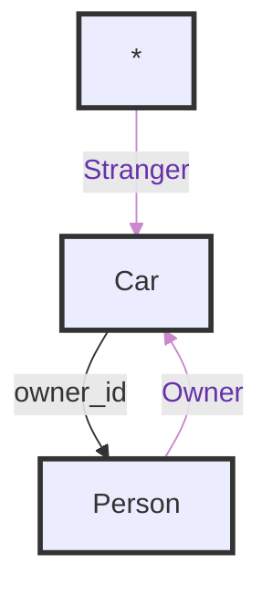
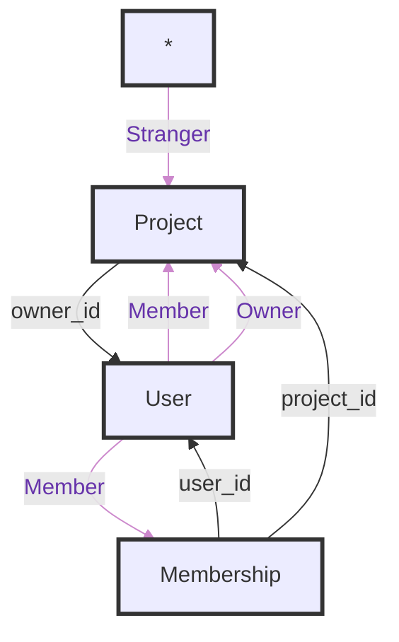

# Graphs

## SLIGHTLY OUTDATED

## Simple Ownership



### schema

```sql
CREATE TABLE people (id varchar(10));

CREATE TABLE cars (id varchar(10), owner_id varchar(10), deleted boolean DEFAULT false);

INSERT INTO people (id) VALUES ('1'), ('2');

INSERT INTO cars (id, owner_id) VALUES ('a', '1'), ('b', '2');
```

### drive

```sql
SELECT goal.*
FROM cars goal
INNER JOIN people entry ON entry.id = goal.owner_id
WHERE entry.id = '1';
```

### view

```sql
(
    SELECT goal.*
	FROM cars goal
	INNER JOIN people entry ON entry.id = goal.owner_id
	WHERE entry.id = '1'
) UNION (
    SELECT goal.*
    FROM cars goal
);

-- needs to be optimized to

SELECT goal.*
FROM cars goal;
```

## Simple Membership



### schema

```sql
CREATE TABLE users (id varchar(10));

CREATE TABLE projects (id varchar(10), owner_id varchar(10));

CREATE TABLE memberships (id varchar(10), project_id varchar(10), user_id varchar(10));

INSERT INTO users (id) VALUES ('1'), ('2'), ('3');

INSERT INTO projects (id, owner_id) VALUES ('a', '1');

INSERT INTO memberships (id, project_id, user_id) VALUES ('m1', 'a', '1'), ('m2', 'a', '2');
```

### manage

```sql
SELECT goal.*
FROM projects goal
INNER JOIN users entry ON entry.id = goal.owner_id
WHERE entry.id = '2';
```

### edit

```sql
(
    SELECT goal.*
    FROM projects goal
    INNER JOIN users entry ON entry.id = goal.owner_id
    WHERE entry.id = '2'
) UNION (
    SELECT goal.*
    FROM projects goal
    INNER JOIN memberships t1 ON t1.project_id = goal.id
    INNER JOIN users entry ON entry.id = t1.user_id
    WHERE entry.id = '2'
);
```

### view

```sql
(
    SELECT goal.*
    FROM projects goal
    INNER JOIN users entry ON entry.id = goal.owner_id
    WHERE entry.id = '2'
) UNION (
    SELECT goal.*
    FROM projects goal
    INNER JOIN memberships t1 ON t1.project_id = goal.id
    INNER JOIN users entry ON entry.id = t1.user_id
    WHERE entry.id = '2'
) UNION (
    SELECT goal.*
    FROM projects goal
);

-- needs to be optimized to

SELECT goal.*
FROM projects goal
```